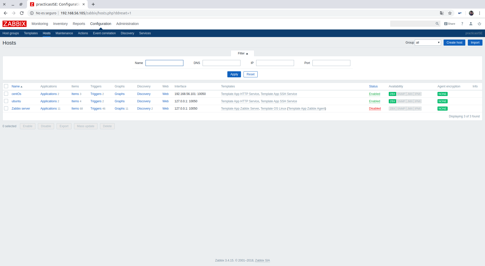
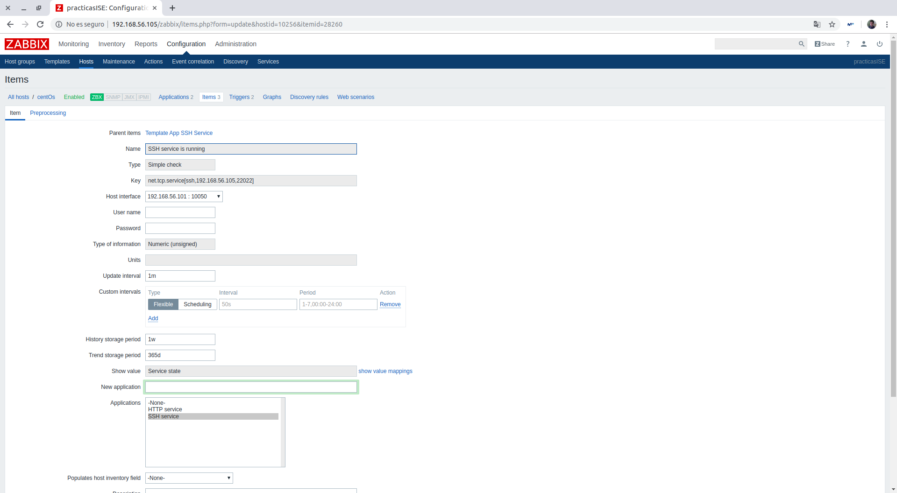
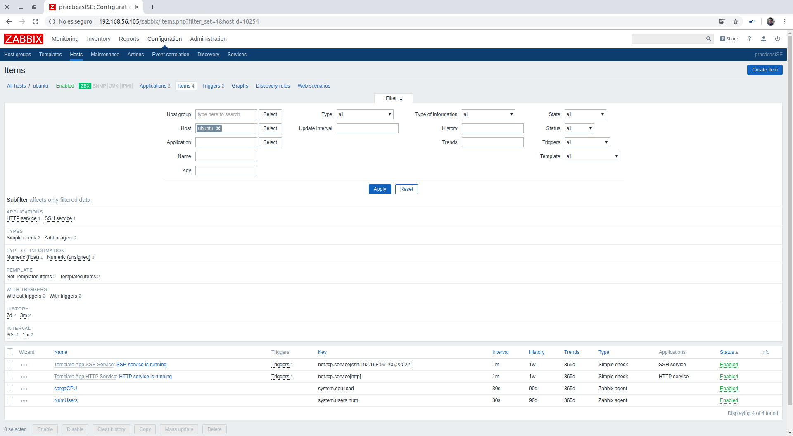
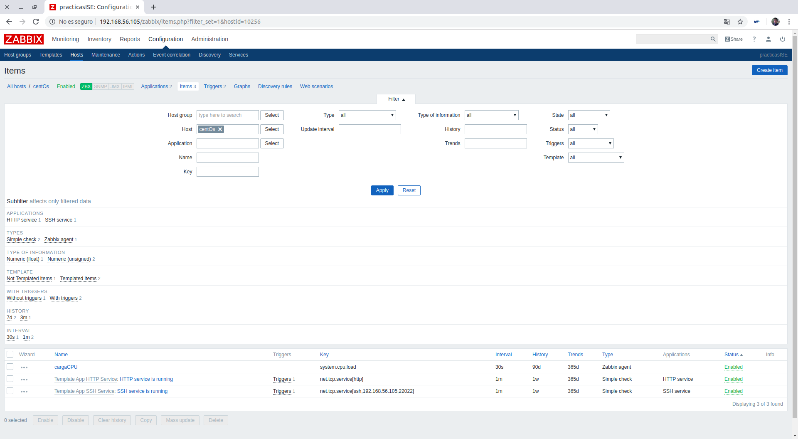
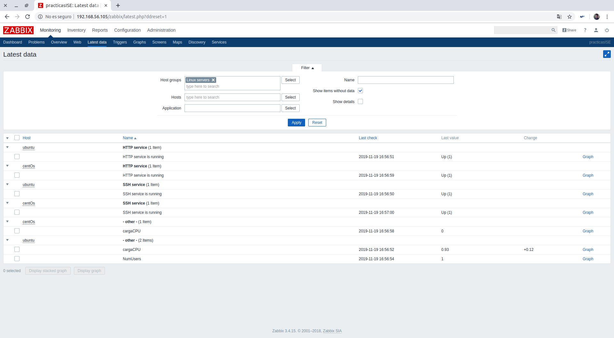

# Práctica 4. Monitorización y "Profiling"
Realizada Guillermo Sandoval Schmidt.

## Objetivos
+ Conocer y saber usar las herramientas que permitan obtener datos sobre el sistema
a nivel hardware y software (SO y servicios).
+ Saber interpretar los resultados proporcionados por las aplicaciones de monitor-
ización.
+ Conocer los archivos que proporcionan información del sistema.
+ Tener conocimiento básico sobre automatización y orquestación
+ Ser capaz de utilizar y configurar un monitor de sistema

## Introducción

Durante la práctica, utilizaremos el softaware de monitorización Zabbix 3.4, utilizando como servidor nuestra máquina de Ubuntu y los agentes para poder monitorear servicios tanto en Ubuntu como en Cent OS.

Particularmente, vas a monitorear los servicios SSH y HTTP de ambas máquinas.

## Instalación del servidor: Zabbix Server

Para empezar, debemos instalar los paquetes necesarios de Zabbix. Utilizaremos los siguientes comandos:

~~~bash
$ wget https://repo.zabbix.com/zabbix/3.4/ubuntu/ pool/main/z/zabbix-release
/zabbix-release _3.4-1+xenial_all.deb

$ dpkg -i zabbix-release_3.4-1+xenial_all.deb

$ apt update
~~~

A continuación, tendremos que instalar el servidor y front-end mediante los comandos:

~~~bash
$ apt install zabbix-server-mysql

$ apt install zabbix-frontend-php
~~~

Tendremos que crear una base de datos y darle permisos a Zabbix para que pueda acceder a ella. Para ello, entraremos en la consola de mysql usando: `mysql -uroot -p` e introduciremos los comandos:

~~~mysql
mysql > create database zabbix character set utf8 collate utf8_bin;

mysql > grant all privileges on zabbix.* to zabbix@localhost identified by ’practicas,ise’;

mysql > quit;
~~~

Tendremos que hacer un volcado de la base de datos (al tener un disco duro HDD, el proceso tardó cerca de 1 hora), con el comando:

~~~bash
$ zcat /usr/share/doc/zabbix-server-mysql/create.sql.gz | mysql -uzabbix -p zab-
bix
~~~

Para que funcione, tendremos que tocar dos archivos de configuración, el primero será el archivo de configuración de Zabbix que podremos acceder a él mediante el comando `vi /etc/zabbix/zabbix_server.conf`, en el que DBName y DBUser tomarán el valor 'zabbix' y DBPassword tomará el valor 'practicas,ISE'; y el segundo será el archivo de configuración de Zabbix en Apache2, al cuál podremos acceder mediante el comando ´vi /etc/apache2/conf-enabled/zabbix.conf´, donde tendremos que descomentar la línea que contiene 'php_value date.timezone Europe/Riga' y modificarlos a nuestra zona horaria (en este caso, Europe/Madrid).

Para que los cambios en los archivos de configuración sean efectivos, tendremos que reiniciar ambos servicios:

~~~bash
$ systemctl start zabbix-server
$ systemctl status zabbix-server
$ systemctl restart apache2
$ systemctl status apache2
~~~

Finalmente, tenemos que configurar el frontend accediendo desde nuestro navegador a la dirección **192.168.56.105/ZABBIX**, siendo la ip de nuestra máquina que hostee Zabbix Server. Usaremos la configuración por defecto y cuando nos pida la clave, utilizaremos la que hemos puesto anteriormente en la base de datos.

## Instalación del agente: Ubuntu Server

Para empezar, debemos instalar el agente en Ubuntu e iniciar el servicio. Utilizaremos los siguientes comandos:

~~~bash
$ apt install zabbix-agent
$ systemctl start zabbix-agent
~~~

Por defecto, la configuración del agente tiene asociada como ip del servidor de Zabbix la dirección 127.0.0.1. Como Ubuntu también lo estamos utilizando como servidor Zabbix, no tendremos que modificar la configuración por defecto.

## Instalación del agente: Cent OS

Para empezar, debemos instalar los paquetes necesarios de Zabbix, instalar el agente e inciarlo. Utilizaremos los siguientes comandos:

~~~bash
$ rpm -ivh https://repo.zabbix.com/zabbix/3.4/rhel/7/x86_64/zabbix-release-3.4-
2.el7.noarch.rpm
$ yum install zabbix-agent
$ systemctl start zabbix-agent
~~~

En este caso, el agente no funcionará directamente, tendremos que abrir puertos y tocar el archivo de configuración de Zabbix.

Para abrir el puerto de Zabbix:
~~~bash
$ firewall-cmd –add-port=10050/tcp –permanent
$ firewall-cmd –reload
~~~

Para tocar el archivo de configuración usaremos el comando `$ vi /etc/zabbix/zabbix_agentd.conf`, poniendo los campos Server y ServerActive a '192.168.56.105'.

Reiniciaremos el servicio `$ systemctl restart zabbix-agent`, pero nos dará un error, arreglandolo usando audit2allow en el archivo audit.log con el comando `$ cat /var/log/audit/audit.log | grep zabbix_agentd | grep denied | audit2allow -M ZA` y añadiendo la nueva regla de SELinux con `$ semodule -i ZA.pp`.

Reiniciaremos de nuevo el servicio y ya estará operativo.

## Monitorizando servicios

En primer lugar, crearemos los host deseados (Ubuntu y Centos) y procederemos a utilizar las *templates* por defecto para monitorear SSH y HTTP.

En el caso del host de CentOS, tendremos que modificar la ip a la de la máquina de ubuntu como se ve en la imagen.

Tendremos que modificar el puerto en el que está configurado SSH tanto en CentOS como en Ubuntu del puerto 22 al 22022, como se puede ver en la imagen.

Podemos ver como quedan los items configurados. En el caso de Ubuntu he añadido un item para monitorizar la carga de la CPU y otro para el número de usuarios logueados. En el de CentOS he añadido únicamente para monitorizar la carga de la CPU.

Finalmente, podemos consultar los últimos datos y si queremos, las gráficas particulares en el apartado de Monitorización de Zabbix.

## Bibliografía
+ https://www.zabbix.com/documentation/3.4/manual
+ http://php.net/manual/en/timezones.europe.php (para ver el formato de la zona horaria)
---

[![Creative Commons License][image-1]][1]  
This work is licensed under a [Creative Commons Attribution 4.0 Unported License][1].

[1]:    http://creativecommons.org/licenses/by/4.0/deed.en_US

[image-1]:    http://i.creativecommons.org/l/by/4.0/80x15.png

Guillermo Sandoval Schmidt
