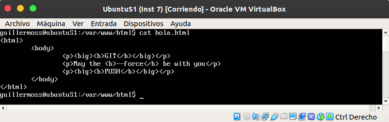
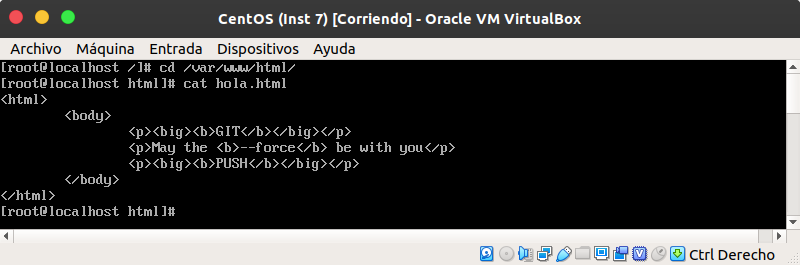
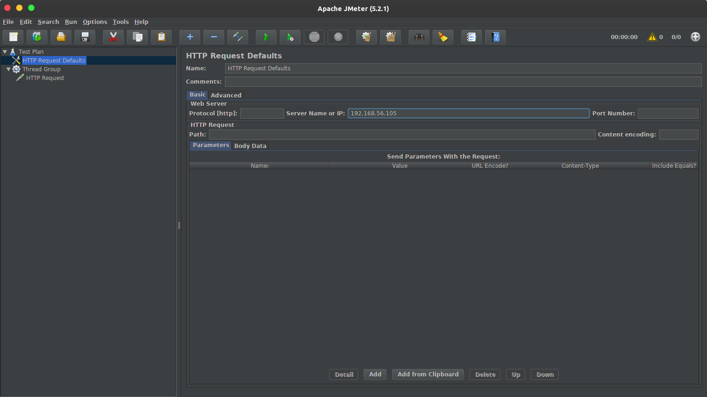
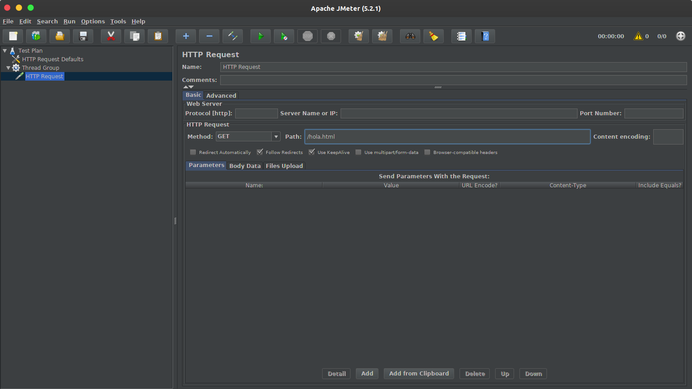
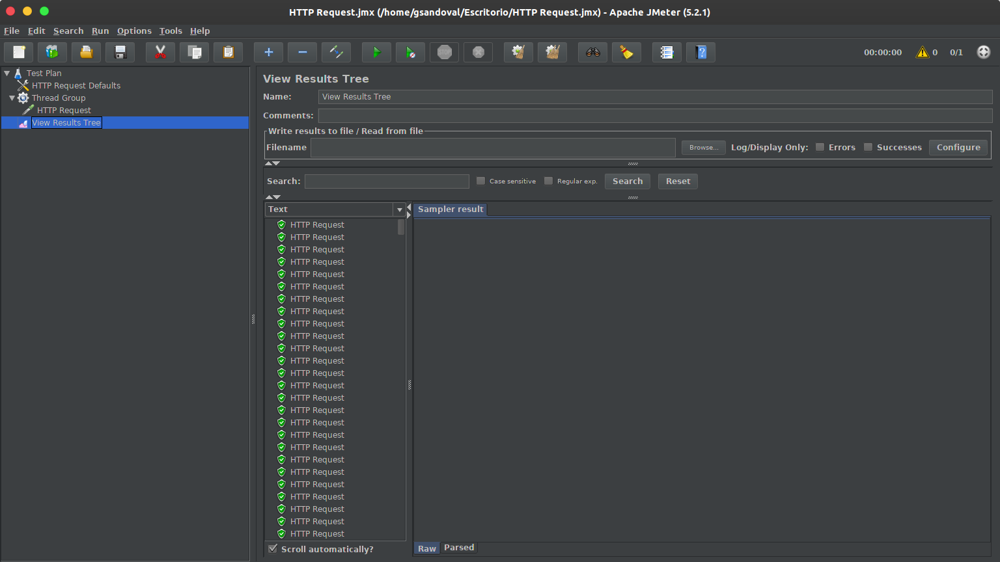
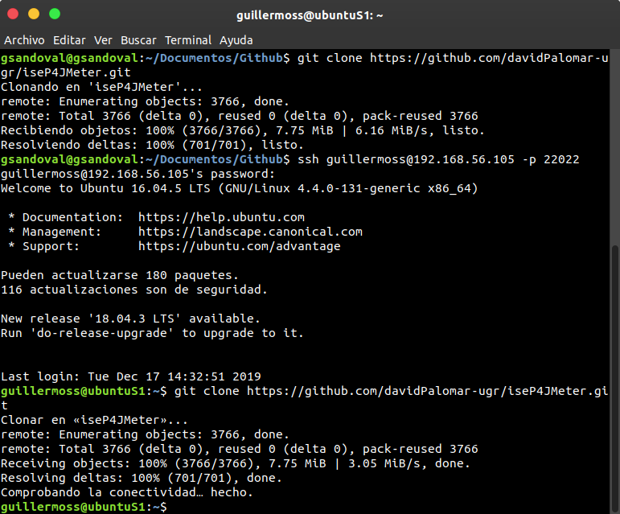
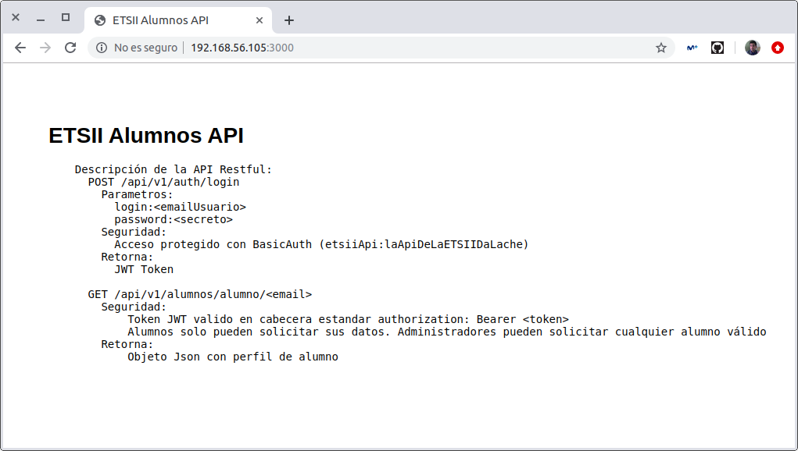
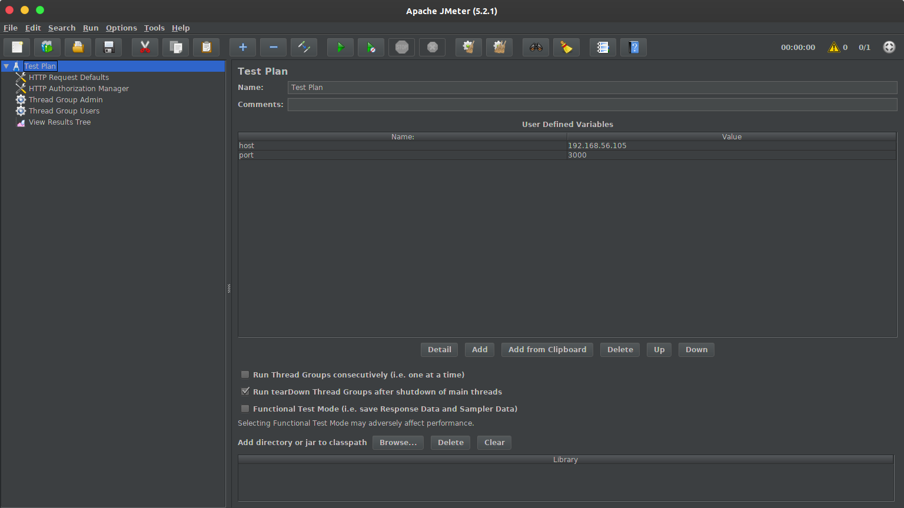
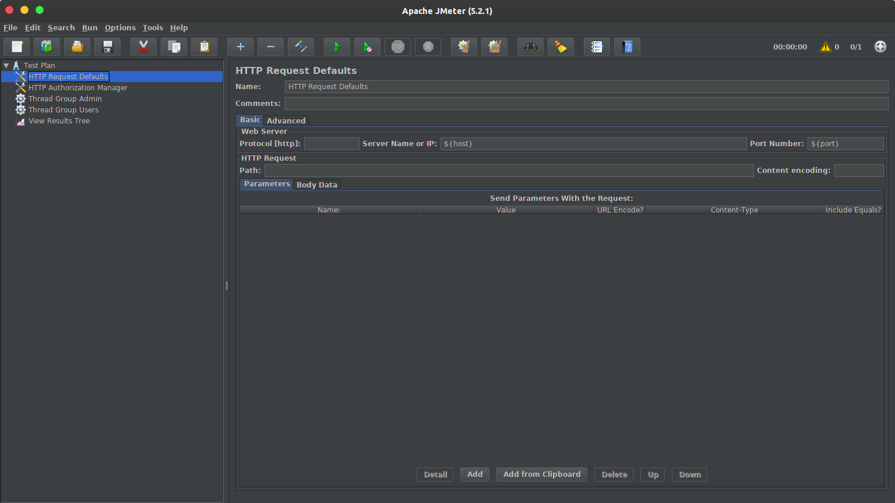
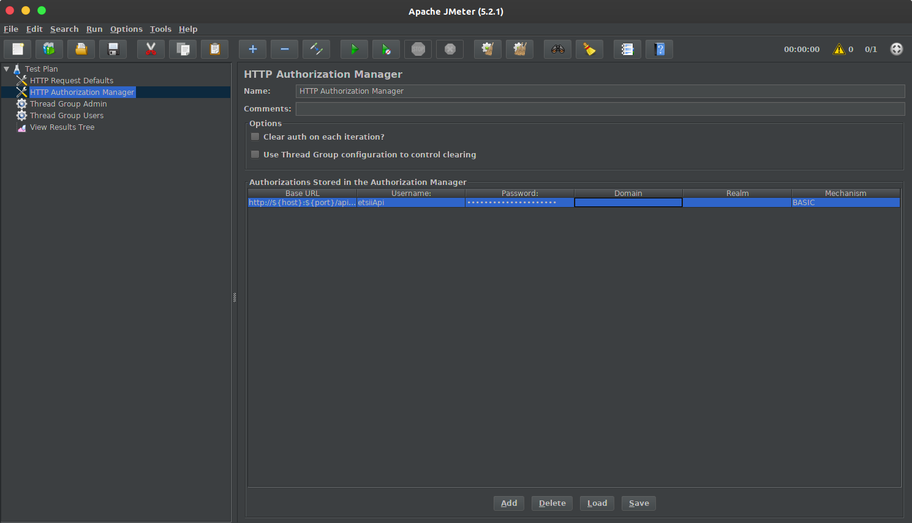

# Práctica 4. Benchmarking y Ajuste del Sistema
Realizada Guillermo Sandoval Schmidt.

## Objetivos
+ Conocer varios benchmarks para diferentes servicios.
+ Saber comparar distintas configuraciones (o implementaciones) de servicios en base
a benchmarks.
+ Aplicar un test de carga a una aplicación basada en microservicios.
+ Conocer y saber cómo modificar el valor algunos parámetros que pueden mejorar
las prestaciones.

# Notas

## Phoronix

Algunos de los benchmark que podríamos ejecutar por ejemplo son apache, php, smallpt o sudokut.

Podemos buscar becnhmarks en páginas como https://openbenchmarking.org.

### Anfitrión

Mi sistema anfitrión es Ubuntu 18.04.3 LTS.

Nos decargamos el paquete desde:

https://www.phoronix-test-suite.com/

Para instalarlo ejecutamos:

`$ sudo dpkg -i phoronix-test-suite_9.0.1_all.deb `

Podemos ejecutar un benchmark (en este caso smallpt):

`$ phoronix-test-suite benchmark smallpt`

Pero primero necesitaremos ejecutar:

`$ yum install php-gd php-xml php-cli`

### Ubuntu Server

~~~
$ wget https://phoronix-test-suite.com/releases/phoronix-test-suite-9.0.1.tar.gz

$ tar xvf phoronix-test-suite-9.0.1.tar.gz

$ cd phoronix-test-suite/

$ sudo ./install-sh

~~~

Podemos ejecutar un benchmark (en este caso smallpt):

`$ phoronix-test-suite benchmark smallpt`

Pero primero necesitaremos ejecutar:

`$ yum install php-gd php-xml`

### CentOS

Recordar entrar como root al inciar sesión.

~~~

$ wget https://phoronix-test-suite.com/releases/phoronix-test-suite-9.0.1.tar.gz

$ tar xvf phoronix-test-suite-9.0.1.tar.gz

$ cd phoronix-test-suite/

$ ./install-sh

~~~

Podemos ejecutar un benchmark (en este caso smallpt):

`$ phoronix-test-suite benchmark smallpt`

Pero primero necesitaremos ejecutar:

`$ yum install php-gd php-xml`

### Docker y Docker-Compose

En mi caso, instalaré Docker y Docker-Compose en Ubuntu Server.

Añadimos la llave GPG (Gnu Privacy Guard) de Docker a APT:

`$ curl -fsSL https://download.docker.com/linux/ubuntu/gpg | sudo apt-key add`

Añadimos los repositorios:

`$ sudo add-apt-repository "deb [arch=amd64]
https://download.docker.com/linux/ubuntu $(lsb_release -cs) stable"`

Y actualizamos e instalamos:

`$ sudo apt update
&& sudo apt install docker-ce docker-compose`

Y tenemos que añadir nuestro usuario (en mi caso guillermoss) al grupo de docker:

`$ sudo usermod -aG docker guillermoss`

Por último debemos reiniciar la máquina para que se apliquen los cambios.

### Phoronix en Docker

Una vez instalado Docker, ejecutamos el siguiente comando para instalar Phoronix:

`$ docker pull phoronix/pts`

En nuestro caso, no tenemos suficiente espacio en /var por lo que no se nos isntalará.

De todos modos, para ejecutarlos una vez instalado, ejecutaríamos:

`$ docker run -it phoronix/pts`

## AB

### Instalación

Como en prácticas anteriores instalamos apache2 y httpd, ab viene instalado junto con Apache.

### Funcionamiento

En mi caso, he creado unos archivos html básicos idénticos tanto en Ubuntu Server como en CentOS.

Nosotros usaremos ab desde nuestro anfitrión con Ubuntu Server y CentOS:

`$ ab -n 1000000 -c 100 http://192.168.56.105/hola.html`

`$ ab -n 1000000 -c 100 http://192.168.56.101/hola.html`

Destacar que debemos solicitar el mismo archivo html en ambas consultas para poder hacer una comparación real entre ambas.

Tras ejecutarlos, obtenemos los siguientes resultados:

## Jmeter

### Instalación

Al ser mi sistema anfitrión Ubuntu, podemos instalar Jmeter desde los paquetes de los repositorios de Ubuntu directamente.

`$ sudo apt install jmeter`

El problema es que la versión que hay en los repositorios es la 2.13, por lo que tendremos que instalar manualmente Jmeter.

Podemos descargar la última versión desde el siguiente enlace e isntalarla del siguiente modo:

~~~
$ wget http://ftp.cixug.es/apache//jmeter/binaries/apache-jmeter-5.2.1.tgz

$ tar xvf apache-jmeter-5-2-1.tar.gz

~~~

Para ejecutarlo, entraremos en la carpeta siguiente y ejecutaremos el siguiente comando:

~~~
$ cd apache-jmeter-5-2-1/bin/

$ ./jmeter
~~~

### Ejecutando Jmeter

Ejecutaremos jmeter desde el terminal en el anfitrión.

Una vez dentro de la interfaz crearemos:

+ HTTP Request Defaults
+ Thread Group
+ Sampler > HTTP Request

Además, tenemos que configurar el 'HTTP Request Defaults' con nuestro puerto 192.168.56.105.

Y configurar el 'HTTP Request' con el path a '/index.html'.

Finalmente, añadiremos un View Results Tree para ver los resultados y ejecutaremos el test.

### iseP4Jmeter

En primer lugar, clonaremos el repositorio entregado para la realizar las prácticas en nuestra máquina (en nuestro caso en Ubuntu Server).

Una vez clonado el repositorio, para ponerlo en marcha, entraremos en la carpeta que acabamos de clonar y tendremos que ejecutar:

`$ docker-compose up -d`

Podemos comprobar que funciona accediendo desde nuestro navegador a la ip 192.168.56.105:3000, y deberíamos ver:

Para parar el servicio, ejecutaremos:

`$ docker-compose down`

---

Una vez tenemos el servicio en marcha, procederemos a configurar el test de Jmeter.

Para ello crearemos un test nuevo y le añadiremos:

+ HTTP Request Defaults
+ HTTP Authorization Manager
+ Thread Group (Admins)
+ Thread Group (Users)
+ View Results Tree

En este caso, definiremos variable en el Test, tanto el host como el puerto que usaremos (192.168.56.105 y 3000 respectivamente).

Además, en HTTP Resquest Defaults lo volveremos a configurar como en el ejemplo básico pero usando esta vez las variables que hemos definido.

En HTTP Authorization Manager añadiremos un elemnto con la URL, nombre de usuario y contraseña de la API.

## Bibliografía

+ https://www.phoronix-test-suite.com/
+ https://openbenchmarking.org
+ https://httpd.apache.org/docs/2.4/programs/ab.html
+ https://packages.ubuntu.com/search?keywords=jmeter

---

[![Creative Commons License][image-1]][1]  
This work is licensed under a [Creative Commons Attribution 4.0 Unported License][1].

[1]:    http://creativecommons.org/licenses/by/4.0/deed.en_US

[image-1]:    http://i.creativecommons.org/l/by/4.0/80x15.png

Guillermo Sandoval Schmidt
