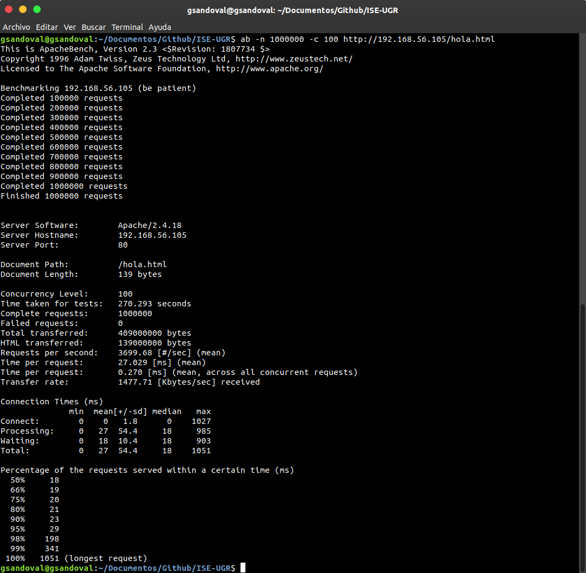
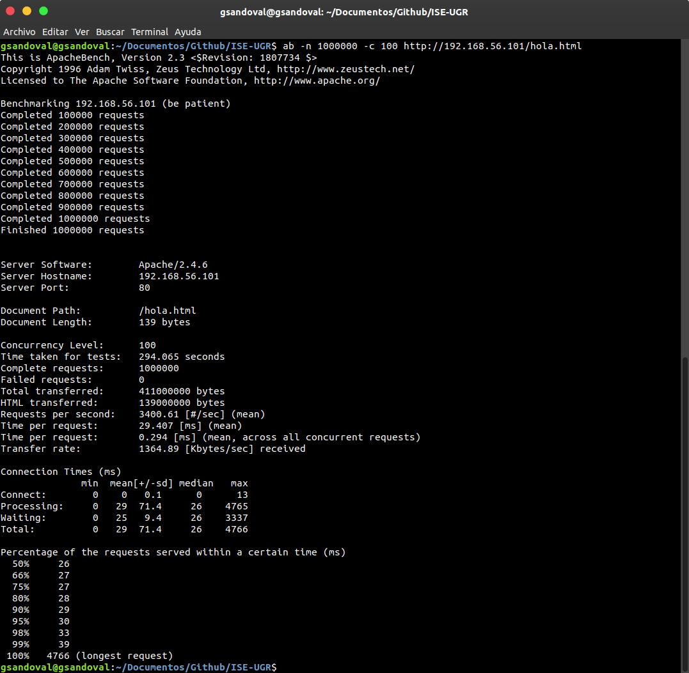

# Práctica 4. Benchmarking y Ajuste del Sistema
Realizada Guillermo Sandoval Schmidt.

## Objetivos
+ Conocer varios benchmarks para diferentes servicios.
+ Saber comparar distintas configuraciones (o implementaciones) de servicios en base
a benchmarks.
+ Aplicar un test de carga a una aplicación basada en microservicios.
+ Conocer y saber cómo modificar el valor algunos parámetros que pueden mejorar
las prestaciones.

# Notas

## Phoronix

Algunos de los benchmark que podríamos ejecutar por ejemplo son apache, php, smallpt o sudokut.

Podemos buscar becnhmarks en páginas como https://openbenchmarking.org.

### Anfitrión

Mi sistema anfitrión es Ubuntu 18.04.3 LTS.

Nos decargamos el paquete desde:

https://www.phoronix-test-suite.com/

Para instalarlo ejecutamos:

`$ sudo dpkg -i phoronix-test-suite_9.0.1_all.deb `

Podemos ejecutar un benchmark (en este caso smallpt):

`$ phoronix-test-suite benchmark smallpt`

Pero primero necesitaremos ejecutar:

`$ yum install php-gd php-xml php-cli`

### Ubuntu Server

~~~
$ wget https://phoronix-test-suite.com/releases/phoronix-test-suite-9.0.1.tar.gz

$ tar xvf phoronix-test-suite-9.0.1.tar.gz

$ cd phoronix-test-suite/

sudo ./install-sh

~~~

Podemos ejecutar un benchmark (en este caso smallpt):

`$ phoronix-test-suite benchmark smallpt`

Pero primero necesitaremos ejecutar:

`$ yum install php-gd php-xml`

### CentOS

Recordar entrar como root al inciar sesión.

~~~

$ wget https://phoronix-test-suite.com/releases/phoronix-test-suite-9.0.1.tar.gz

$ tar xvf phoronix-test-suite-9.0.1.tar.gz

$ cd phoronix-test-suite/

$ ./install-sh

~~~

Podemos ejecutar un benchmark (en este caso smallpt):

`$ phoronix-test-suite benchmark smallpt`

Pero primero necesitaremos ejecutar:

`$ yum install php-gd php-xml`

### Docker y Docker-Compose

En mi caso, instalaré Docker y Docker-Compose en Ubuntu Server.

Añadimos la llave GPG (Gnu Privacy Guard) de Docker a APT:

`$ curl -fsSL https://download.docker.com/linux/ubuntu/gpg | sudo apt-key add`

Añadimos los repositorios:

`$ sudo add-apt-repository "deb [arch=amd64]
https://download.docker.com/linux/ubuntu $(lsb_release -cs) stable"`

Y actualizamos e instalamos:

`$ sudo apt update
&& sudo apt install docker-ce docker-compose`

Y tenemos que añadir nuestro usuario (en mi caso guillermoss) al grupo de docker:

`$ sudo usermod -aG docker guillermoss`

Por último debemos reiniciar la máquina para que se apliquen los cambios.

### Phoronix en Docker

Una vez instalado Docker, ejecutamos el siguiente comando para instalar Phoronix:

`$ docker pull phoronix/pts`

En nuestro caso, no tenemos suficiente espacio en /var por lo que no se nos isntalará.

De todos modos, para ejecutarlos una vez instalado, ejecutaríamos:

`$ docker run -it phoronix/pts`

## AB

### Instalación

Como en prácticas anteriores instalamos apache2 y httpd, ab viene instalado junto con Apache.

### Funcionamiento

En mi caso, he creado unos archivos html básicos idénticos tanto en Ubuntu Server como en CentOS.

Nosotros usaremos ab desde nuestro anfitrión con Ubuntu Server y CentOS:

`$ ab -n 1000000 -c 100 http://192.168.56.105/hola.html`

`$ ab -n 1000000 -c 100 http://192.168.56.101/hola.html`

Destacar que debemos solicitar el mismo archivo html en ambas consultas para poder hacer una comparación real entre ambas.

Tras ejecutarlos, obtenemos los siguientes resultados:

## Bibliografía

+ https://www.phoronix-test-suite.com/
+ https://openbenchmarking.org

---

[![Creative Commons License][image-1]][1]  
This work is licensed under a [Creative Commons Attribution 4.0 Unported License][1].

[1]:    http://creativecommons.org/licenses/by/4.0/deed.en_US

[image-1]:    http://i.creativecommons.org/l/by/4.0/80x15.png

Guillermo Sandoval Schmidt
